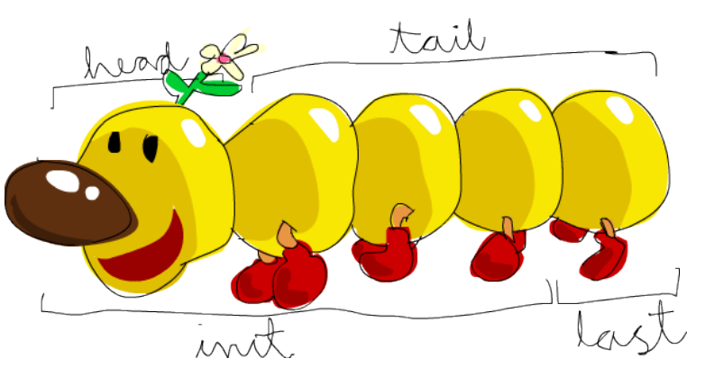

# Haskell (INFO3)
## Listes

**Question 1: Expressions de Liste**
1. Une liste s’ecrit entre crochets, avec les éléements de la liste séparés par des virgules. Rappelez ce que font les operateurs ``[]``, ``:`` et ``++``.
* ``[]`` : Liste vide (aussi la fin de liste).
* ``:`` : Opérateur d'ajout d'un élément au début d'une liste.
* ``a ++ b`` : Concaténation de listes ; La première liste va être dupliquée et son dernier élément va pointer sur le premier élément de b.
2. Evaluez les expressions de liste suivantes :
```haskell
1:[2] -- [1, 2]
[3,4]++[1,2] -- [3, 4, 1, 2]
[3..10] -- [3, 4, 5, 6, 7, 8, 9, 10]
tail [1..4] ++ 5:[] -- [2, 3, 4, 5]
head [1..4] : [5] -- [1, 5]
reverse [1..4] ++ [5] -- [4, 3, 2, 1, 5]
1 : reverse [2..5] -- [1, 5, 4, 3, 2]
```
**Question 2: Définition de fonctions sur les listes**
1. Rappelez ce que font les fonctions suivantes définies dans ``prelude.hs`` :
* ``head`` : Retourne le premier élément de la liste.
* ``tail`` : Retourne la liste sans le premier élément.
* ``reverse`` : Inverse la liste.
* ``length`` : Retourne la longueur de la liste.
* ``drop`` : Prend en paramètre un entier N et une liste L et retourne L sans les N premiers éléments.
* ``take`` : Prend en paramètre un entier N et une liste L et retourne une liste avec les N premiers éléments de L.
* ``!!`` : Retourne l'élément de la liste avec l'indice indiqué.
* ``tails`` : Retourne une liste de listes contenant successivement les queues de chaque liste.


2. La fonction ``last``, définie dans ``prelude.hs``, selectionne le dernier éléement d’une liste. Simulez dans ghci le comportement de last exclusivement a l’aide des fonctions :
```haskell
lst = [1, 2, 3, 4, 5]
```
* ``head`` et ``reverse``
```haskell
head (reverse lst)
```
* ``length`` et ``!!``
```haskell
lst !! (length lst - 1)
```
* ``head``, ``drop`` et ``length``.
```haskell
head (drop (length - 1) lst)
```
Donnez ensuite une version récursive de la fonction ``last``.
```haskell
-- To be written in a file `Last.hs`
last' :: [a] -> a
last' []			= error "empty list"
last' (_ : x : [])	= x
last' (_ : xs)		= last' xs

{- Teacher's reference
last' [] = error "*** Exception: last: empty list"
last' [x] = x
last' (_ : xs) = last' xs
-}
```

3. La fonction ``init``, definie dans ``prelude.hs``, supprime le dernier élément d’une liste. Simulez dans ghci le comportement de init exclusivement a l’aide des fonctions suivantes :
* ``take`` et ``length``
```haskell
take (length lst - 1) lst
```
* ``tail`` et ``reverse``
```haskell
reverse(tail (reverse lst))
```
* ``tails``, ``reverse`` et ``!!``
```haskell

```
Donner ensuite une version recursive de la fonction
```haskell
-- To be written in a file `Init.hs`
init' :: [a] -> [a]
init' []	= error "empty list"
init' [x] 	= []
init' (x : xs) = x : init' xs
```

**Question 3: Chaînes de caractères**
Un palindrome un mot dont l’ordre des lettres reste le meme qu’on le lise de gauche à droite
ou de droite à gauche, comme dans la phrase "Esope reste ici et se repose".

1. Comment tester si un mot (i.e., une chaîne de caractères sans caractère espace) est un
palindrome ? (Accents et majuscules ne sont pas utilisés ici.)
On divise la chaîne de caractères par deux (si longueur impaire, on ne tient pas compte du caractère du milieu) et on compare la première partie avec la deuxième partie en reversed.

2. Comment tester si une chaîne de caracteres est un palindrome ? (Accents et majuscules ne sont pas utilisés ici mais le mot peut contenir des caractères espace dont il ne faut pas tenir compte.)
On enlève les caractères espace et on refait la manip décrite ci-dessus.

3. Ecrire une fonction qui teste si un mot est un palindrome ? (Accents et majuscules ne sont pas utilisés ici.) Quel doit être le type de cette fonction ?
```haskell
isPalindrome :: [a] -> Bool
isPalindrome [] = error "empty string cannot be a palindrome"
isPalindrome xs = xs == reverse xs
```

4. Ecrire une fonction qui teste si une chaîne de caractères est un palindrome ? (Accents et majuscules ne sont pas utilisés ici mais la chaîne peut contenir des caractères espace
dont il ne faut pas tenir compte..) Quel doit être le type de cette fonction ?
```haskell
import Data.Char(isSpace)
import Data.List
trimmed = dropWhileEnd isSpace . dropWhile isSpace


```

**Question 4: Types**
1. Quel est le type des valeurs suivantes :
* [’a’,’b’,’c’] :: [Char]
* [1, 2, 3] :: Num a => a
* [[’a’,’b’],[’c’,’d’]] :: [[Char]]
* [[’1’,’2’],[’3’,’4’]] :: Num a => [[a]]
* (’a’,’b’) :: (Char, Char)
* (’a’,’b’,’c’) :: (Char, Char, Char)
* (1,2) :: Num a => (a, a)
* (1,2,3) :: Num a => (a, a, a)
* [(False,’0’),(True,’1’)] :: Num a => [(Bool, a)]
* ([False,True],[’0’,’1’]) :: Num a => ([Bool], [a])
* [tail,init,reverse] :: [[a] -> [a]]
* ([tail,init,reverse],[take,drop]) :: ([[a1] -> [a1]], [Int -> [a2] -> [a2]])

2. Expliquer la session suivante :
```haskell
>>>import Data.List
>>>:type(head, take)(head, take)::([a]->a,Int ->[a1]->[a1])
>>>:type[head, take]

<interactive>:1:8:
	Couldn’tmatchtype ’Int’with’[[a] ->[a]]’
	Expected type:[[a]->[a]]->[a]->[a]
	Actual type: Int ->[a]->[a]
	In the expression:take
	In the expression:[head, take]
Prelude Data.List>
```
L'interpréteur râle car head et take ont des types différents. Un tuple admet des éléments de type différents tandis que la liste a besoin nécessairement d'éléments de même type.

**Question 5: Fonctions**

* second xs=head (tail xs)
* appl (f,x)=f x
* pair x y=(x,y)
* mult x y=x*y
* double=mult 2
* palindrome xs=reverse xs == xs
* twice f x=f (f x)
* incrAll xs=map (+1) xs
* norme xs=sqrt (sum (map f xs))wheref x=xˆ2.

1. Calculez les types de ces fonctions, en n’oubliant pas les contraintes de classe.
* second :: [a] -> a
* appl :: (t1, t2, t1) -> t2
* pair :: a1 -> a2 -> (a1, a2)
* mult :: Num a => a -> a -> a
* double :: Num a => a -> a
* palindrome :: [a] -> Bool
* twice :: (t -> t) -> t -> t
* incrAll :: Num a => [a] -> [a]
* norme :: Num a => [a] -> a

2. Donnez une forme curifiée de la fonction appl.
```haskell
appl' f x = f x
```

3. Quelles sont les *fonctions d'ordre supérieur* ?
Ce sont les fonctions qui prennent d'autres fonctions en paramètre : appl, twice

4. Quelles sont les *fonctions polymorphes* ?
Ce sont des fonctions dont les paramètres peuvent prendre plusieurs types.

5. A l’aide d’une compréhension de liste, calculer la liste de carrés des entiers pairs (i.e.,les entiers $i^2$ pour i = 2,4,...).
```haskell
getSquareList xs = [x * x | x <- xs, mod x 2 == 0]

getSquareList' xs = [x * x | x <- xs, even x]
```
6. A l’aide d’une compréhension de liste, calculer la liste : ``[[1],[1,2],[1,2,3],[1,2,3,4],[1,2,3,4,5]]``
```haskell
[[x]]
```